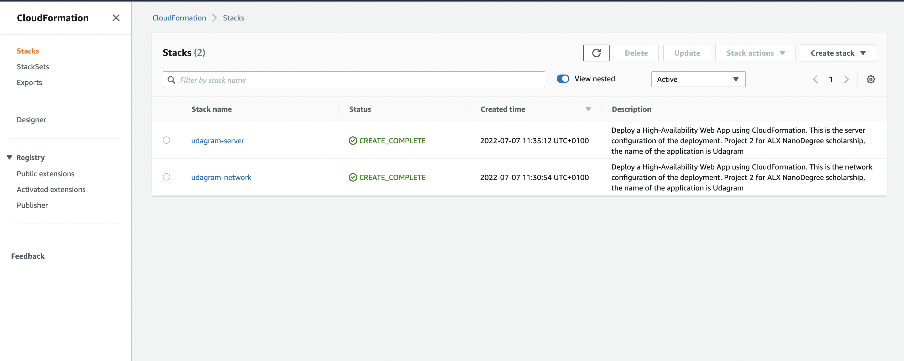
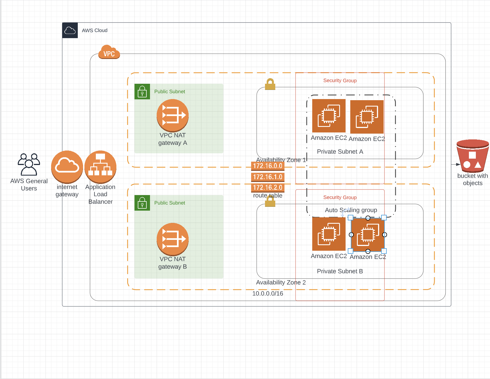

# Udagram
ALX Project Two: Deploy a High-Availability Web App using CloudFormation

### Steps to test
- Clone Repo
- To be able to use the create and update stack script, run the following command `chmod +x create-stack.sh` for the create stack command and `chmod +x update-stack.sh` to grant access
- Update your AWS credentials in the config file to have access to CloudFormation
- Run `./create-stack.sh <network-name> network.yml  network.json ` to create the network configuration for Udagram 
- Run `./create-stack.sh <server-name> server.yml  server.json ` to create the server configuration for Udagram

Load Balancer - http://udagr-webap-1ekn4vbnu7ltr-628410637.us-east-1.elb.amazonaws.com/

The Image below shows the stack creation success

The Image below shows the Lucid Diagram for the infrastructure

